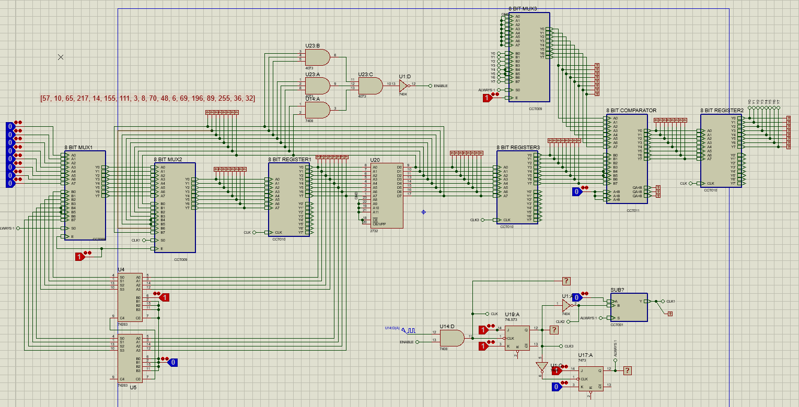

# Singly Linked List Circuit Implementation
Proteus simulation of a circuit that is capable of traversing through a linked list stored in ROM(2732).

## What the circuit is capable of?
The circuit has a ROM (IC 2732) which stores a singly linked list in the form of array of elements. 
Every node at a particular address has the following components -
- Data element of 8 bits
- 8 bit Address of next node at address+1

What the circuit does is that it traverses through the linked list and outputs the data of the minimum data element.

## Circuital Solution

